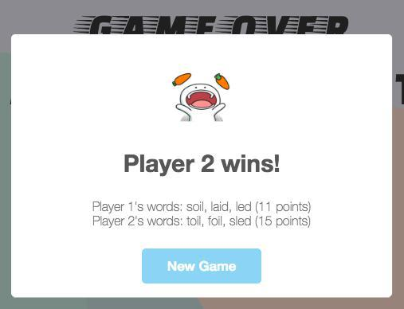

# Booger

A game like Boggle but not really.

Score the most points by forming words from the given alphabet pool. (Psst, use the `shuffle` button to shuffle the alphabets if you need more "inspiration"!)

Each player will receive points based on the number of characters used in their word.
Eg. "food" gets 4 points, "bread" gets 5 points

"Rare" characters such as "Q", "Z", "X", "J", "K" or "F", "H", "V", "W", "Y" will get you an extra 5 or 3 points respectively.
Eg. "kick" gets 4 + 5 + 5 = 14 points, "wave" gets 4 + 3 + 3 = 10 points

Any words less than three characters long will be considered invalid.

No points will be awarded if a word has been played by ANY player in the same game, so be sure to play all your best possible words as early in the game as possible!

[Play it here :3](https://wdi-sg.github.io/wdi-project-1-imouto2005/)

## Gameplay

Text inputs will rotate between the two players according to their turn. The input field has been set to password to prevent players from copying their opponent's answers.

Scores will be tabulated according to the above guide and a winner will be declared at the end of three rounds.

## Built With

* HTML
* CSS
* Javascript
* [jQuery](http://jquery.com/)

## Workflow

1. Brainstorm and come up with game logic/mechanics
2. Find and convert dictionary into JSON format
3. Write game logic code
4. Add in styling once the game is working
5. Add in small, extra features to improve the game experience

## Development

### Notable Areas

#### 1. Importing my dictionary

The first dictionary that I used was inadequate as it did not consider the plural forms of words as valid words. I then found a more comprehensive [dictionary](http://app.aspell.net/create) that seemed to better suit my needs.

I saved the list of generated words in a `txt` file and used `fs.readFile` in node to read the file. I then converted the contents of the file into an object with the dictionary words as the keys.

Next, I used `fs.writeFile` to create a new `txt` file with the object I created. Lastly, I used `JSON.parse` on the object in a separate JavaScript file and linked it to my HTML to incorporate it in my game.

#### 2. The alphabet pool

My alphabet pool was made by extracting four random four-lettered words from my dictionary and shuffling the characters of these four words to form an alphabet pool of 16 alphabets.

I decided to do this instead of simply extracting 16 random alphabets from an array of 26 alphabets as I wanted to ensure that players would always be able to form valid words from the alphabet pool.

#### 3. Fisher-Yates Shuffling Algorithm

Shuffling the alphabets from the four random words to create my alphabet pool was also another challenge I faced.

I used the Durstenfeld version of the Fisher-Yates algorithm that works by choosing one random alphabet for each original alphabet in my array of alphabets, and then excluding it from the next draw.

The exclusion is done by switching the chosen alphabet with the current alphabet before choosing the next random alphabet from the remaining alphabets. This process is repeated until only one alphabet remains, upon which it will be skipped as there will be no remaining alphabets.

### **Rough Sketches vs Final Product**

### Evolution of game mechanics over time
#### **First Version**
Two players competing to form the longest word from the given alphabet pool.

#### **Second Version**
Two players competing to form as many words as they can. The first player who is unable to form any more new words from the alphabet pool loses the game.

#### **Final Version**
Two players competing to get the most number of points within a fixed number of rounds. Points will be awarded according to a scoring system.

### **Checklists**
I would always have a checklist of tasks beside me as I was working on my game. I feel that it is a good way for me to keep track of all the things that need to be done and has helped me avoid feeling overwhelmed.

## Authors

* **ME** - [imouto2005](https://github.com/imouto2005)

## References

* [How do I read files in node.js?](https://docs.nodejitsu.com/articles/file-system/how-to-read-files-in-nodejs/)
* [How do I write files in node.js?](https://docs.nodejitsu.com/articles/file-system/how-to-write-files-in-nodejs/)
* [Fisher-Yates Algorithm: The Logic Behind Shuffling](https://medium.com/@thelextimes/fisher-yates-algorithm-the-logic-behind-shuffling-98deb8bac210)
* [How To Make a Modal Box With CSS and JavaScript](https://www.w3schools.com/howto/howto_css_modals.asp)
* [SweetAlert](http://t4t5.github.io/sweetalert/)
* [Stack Overflow](http://stackoverflow.com/)
* [Dictionary](http://app.aspell.net/create)

## Acknowledgements

[:)](https://github.com/siawyoung) 
