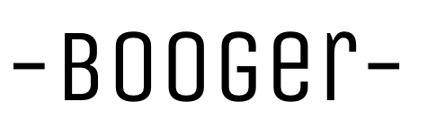

# Booger

A game like Boggle but not really.

Form as many long words as you can from the given set of alphabets!

Each player will receive points based on the number of characters used in their word.
Eg. "food" gets 4 points, "bread" gets 5 points

"Rare" characters such as "Q", "Z", "X", "J", "K" or "F", "H", "V", "W", "Y" will get you an extra 5 or 3 points respectively.
Eg. "kick" gets 4 + 5 + 5 = 14 points, "wave" gets 4 + 3 + 3 = 10 points
      
Any words less than three characters long will be considered invalid.
      
No points will be awarded if a word has been played by ANY player in the same game, so be sure to play all your best possible words as early in the game as possible! 

[Play it here :3](https://wdi-sg.github.io/wdi-project-1-imouto2005/)

## Gameplay

Text inputs will rotate between the two players according to their turn.

The input field has been set to password to prevent players from copying their opponent's answers.

Scores will be tabulated according to the above guide and a winner will be declared at the end of three rounds.

## Built With

* HTML
* CSS
* Javascript
* [jQuery](http://jquery.com/)

## Workflow

1. Brainstorm and come up with game logic
2. Convert dictionary into JSON object
3. Write game logic code
4. Add in styling once the game is working
5. Adding in small, extra features to improve the game experience

## Development

#### **Checklists**
I would always have a checklist of tasks beside me as I was working on my game. I feel that it is a good way for me to keep track of all the things that need to be done and has helped me avoid feeling overwhelmed. 

#### **Rough sketches**
[sketches](assets/img/comparison.png)

#### **First Version**
Two players competing to form the longest word from the given alphabet pool.

#### **Second Version**
Two players competing to form as many words as they can. The first player who is unable to form more words loses the game.

#### **Third Version**
Two players competing to get the most number of points within a fixed number of rounds that are awarded according to a scoring system. 

## Authors

* **ME** - [imouto2005](https://github.com/imouto2005)

## References

* [How do I read files in node.js?](https://docs.nodejitsu.com/articles/file-system/how-to-read-files-in-nodejs/)
* [How do I write files in node.js?](https://docs.nodejitsu.com/articles/file-system/how-to-write-files-in-nodejs/)
* [Fisher-Yates Algorithm: The Logic Behind Shuffling](https://medium.com/@thelextimes/fisher-yates-algorithm-the-logic-behind-shuffling-98deb8bac210)
* [How To Make a Modal Box With CSS and JavaScript](https://www.w3schools.com/howto/howto_css_modals.asp)
* [SweetAlert](http://t4t5.github.io/sweetalert/)

## Acknowledgements

[:)](https://github.com/siawyoung) 
